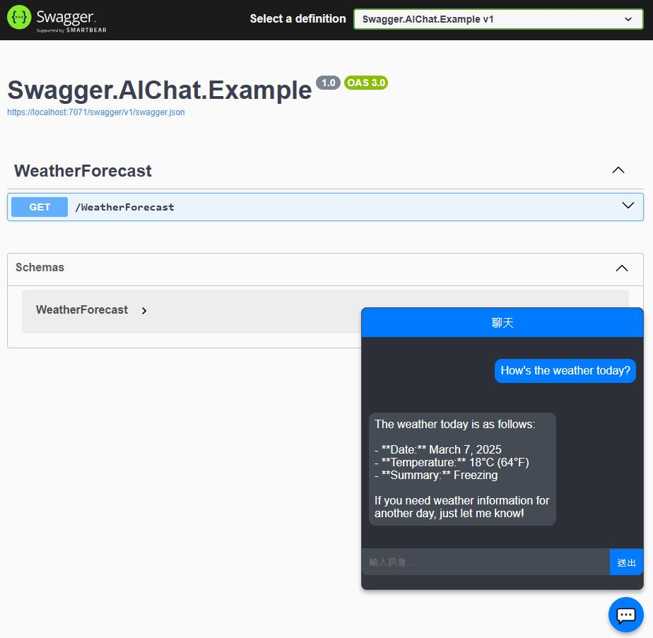

[](https://github.com/solawish/Swagger.AIChat/actions/workflows/dotnet.yml)
[](https://www.nuget.org/packages/Swagger.AIChat/)


# Swagger AI Chat Example

This repository contains an example of how to integrate Swagger (OpanAPI) with an AI chat application in C#. 

## AI Chat Integration

You can interact with the Swagger API through an AI chat interface. This allows you to send requests and receive responses directly from the chat, making it easier to test and use the API without needing to manually navigate the Swagger UI.

## Using Semantic Kernel for AI Integration

This example leverages Semantic Kernel as the medium for integrating AI capabilities. Semantic Kernel provides a robust framework for building and deploying AI models, making it easier to incorporate advanced AI functionalities into your applications.



### Semantic Kernel Integration

For detailed usage, refer to the code example below:

This code snippet describes how to add the configuration:
```csharp
builder.Services.AddSingleton(new ChatAISetting 
{
    SystemPrompt = "You are an AI assistant that can help users call APIs.",
    OpenAPIPluginName = "weather_api",
    OpenAPIUrl = "https://localhost:7071/swagger/v1/swagger.json"
} );
```

This code snippet describes how to add the configuration for Chat AI resources.
```csharp
app.UseSwaggerUI(options => options.AddSwaggerChatAIUI());
app.UseSwaggerChatAIUI();
```

You can find the complete code implementation in the `Program.cs` file. This file contains all the necessary configurations and setup required to integrate Swagger with the AI chat application.

### Usage

Once the application is running, you can access the Swagger UI by navigating to `https://localhost:7071/swagger` in your web browser. This will provide you with an interactive interface to test the API endpoints.

## Contributing

If you would like to contribute to this project, please fork the repository and submit a pull request.

## License

This project is licensed under the MIT License.
